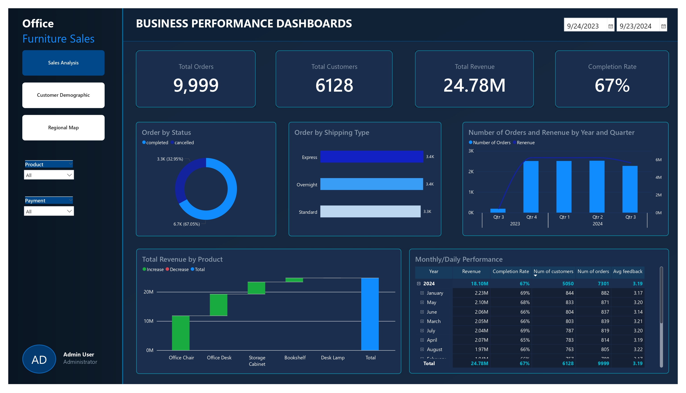

# 📊 Business Sales Performance Dashboard

A Power BI dashboard analyzing business sales performance based on orders, customers, products, payments, and shipping data.

## 📁 Data Sources

| File | Rows | Description |
|------|------|-------------|
| `customer.csv` | 12,136 | Customer information (age, gender) |
| `orders.csv` | 9,999 | Orders, status, and feedback |
| `product.csv` | 13 | Product catalog & unit price |
| `payment.csv` | 5 | Payment methods |
| `shipping.csv` | 5 | Shipping categories & cost levels |

## 🛠️ Tools Used
- Power BI Desktop
- Data format: CSV

## 🚀 How to Use
1. Download the `.pbix` file
2. Open it with Power BI Desktop
3. If needed, reconnect the data source to the `data/raw/` folder

## 📸 Screenshots

